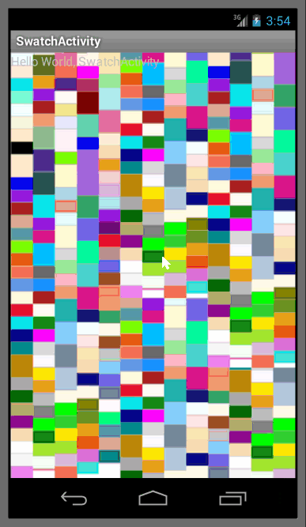

# AshaNetApp

Android app for browsing, donating to and posting updates to
Ashanet.org educational programs.  It is aiming for feature and UX
equivalence with https://github.com/sagpatil/AshaNet_iOS

## Implemented Functionality

* ☑ As a potential donor, I can see a list of projects. (#5)

* ☐ As a potential donor, I can see the details of a project (#6)

* ☐ As a user, I can control application settings (#10)

  * ☐ As an administrator, I can log in to the app. (#9)

So far, the development of this Android app has taken about 3 hours.

This program is distributed in the hope that it will be useful,
but WITHOUT ANY WARRANTY; without even the implied warranty of
MERCHANTABILITY or FITNESS FOR A PARTICULAR PURPOSE.

## Author and License

Copyright (c) 2014, Sam Vilain.  All Rights Reserved.  This program is
Free Software; you can use it and/or modify it under the terms of the
[Lesser GNU Public License (LGPL) version 3.0](https://www.gnu.org/licenses/lgpl.html),
or, at your option, any later version.

You should have received a copy of the Lesser GNU General Public
License along with this program.  If not, see <http://www.gnu.org/licenses/>.

If this license is inconvenient for your purposes, please contact the
author to negotiate a different Free Software License.
